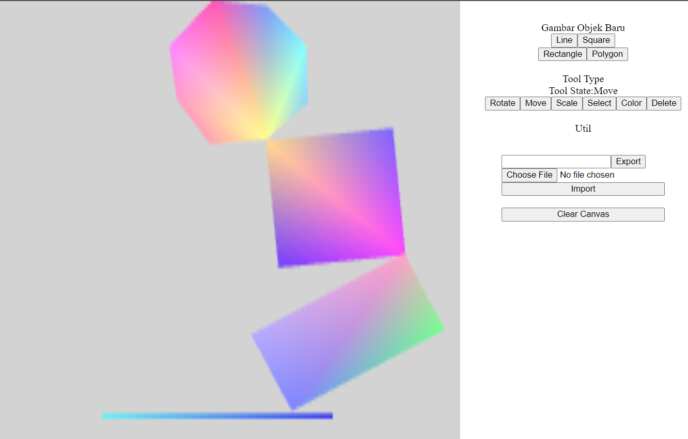

# Tugas Besar 1 IF3260 Grafika Komputer

<table>
    <tr>
        <td colspan = 3 align = "center">
            KELOMPOK 12 - K03
        </td>
    </tr>
    <tr>
        <td align="center">No</td>
        <td align="center">Nama</td>
        <td align="center">NIM</td>
    </tr>
    <tr>
        <td align="center">1</td>
        <td align="center">Steven</td>
        <td align="center">13520131</td>
    </tr>
    <tr>
        <td align="center">2</td>
        <td align="center">Jundan Haris</td>
        <td align="center">13520155</td>
    </tr>
    <tr>
        <td align="center">3</td>
        <td align="center">Willy Wilsen</td>
        <td align="center">13520160</td>
    </tr>
</table>

## 2D Web Based CAD (Computer-Aided Design)

### Overview

Pengguna dapat berkreasi melalui interaksi dengan canvas menggunakan berbagai tools yang tersedia pada bagian sebelah kanan dari kanvas. Untuk menentukan jenis objek yang akan digambar, pengguna dapat memilih sendiri objek yang ingin digambarkan melalui button yang tertera (button line, square, rectangle, dan polygon). Terdapat pula berbagai fungsi tambahan (rotate, move, scale, select, color, dan delete) yang dapat membantu pengguna dalam melakukan perubahan pada gambar yang telah dicetak pada kanvas, untuk selengkapnya mengenai fungsi tambahan, silahkan baca pada dokumentasi/laporan pada folder doc.

Selain itu, terdapat juga button untuk melakukan pembersihan kanvas serta button untuk melakukan export dan import file. Button export seperti namanya, memungkinkan pengguna untuk melakukan export dari objek-objek yang ada pada kanvas ke dalam sebuah file bertipe .txt. Sementara itu, button import didampingi oleh button choose file agar pengguna dapat menentukan file apa yang ingin di-load ke dalam kanvas. Ketika button import ditekan, kanvas akan dibersihkan dahulu sebelum melakukan import model. Hal ini dilakukan agar objek-objek lama tidak muncul pada model yang baru diimport.

### Checklist dan Pembagian Tugas
<table>
    <tr>
        <td colspan = 3 align = "center">
            Fitur Wajib
        </td>
    </tr>
    <tr>
        <td align="center">Spesifikasi</td>
        <td align="center">Terselesaikan</td>
        <td width="30%" align="center">Oleh</td>
    </tr>
    <tr>
        <td align="center">Mengubah panjang garis</td>
        <td align="center"><strong>✓</strong></td>
        <td align="center">13520131 - Steven</td>
    </tr>
    <tr>
        <td align="center">Mengubah panjang sisi persegi</td>
        <td align="center"><strong>✓</strong></td>
        <td align="center">13520131 - Steven</td>
    </tr>
    <tr>
        <td align="center">Mengubah panjang atau lebar persegi panjang</td>
        <td align="center"><strong>✓</strong></td>
        <td align="center">13520155 - Jundan Haris</td>
    </tr>
    <tr>
        <td align="center">Menambah dan menghapus titik sudut polygon</td>
        <td align="center"><strong>✓</strong></td>
        <td align="center">13520131 - Steven 13520160 - Willy Wilsen</td>
    </tr>
    <tr>
        <td align="center">Transformasi geometri minimal 2 (transformasi, dilatasi, rotasi, shear) pada setiap model</td>
        <td align="center"><strong>✓</strong></td>
        <td align="center">13520131 - Steven 13520155 - Jundan Haris 13520160 - Willy Wilsen</td>
    </tr>
    <tr>
        <td align="center">Menggerakkan salah satu titik sudut dengan slider atau drag and drop pada setiap model</td>
        <td align="center"><strong>✓</strong></td>
        <td align="center">13520131 - Steven</td>
    </tr>
    <tr>
        <td align="center">Mengubah warna salah satu atau semua titik sudut</td>
        <td align="center"><strong>✓</strong></td>
        <td align="center">135201131 - Steven</td>
    </tr>
    <tr>
        <td align="center">Melakukan save and load model</td>
        <td align="center"><strong>✓</strong></td>
        <td align="center">13520160 - Willy Wilsen</td>
    </tr>
    <tr>
        <td colspan = 3 align = "center">
            Fitur Lanjutan
        </td>
    </tr>
    <tr>
        <td align="center">Algoritma convex hull pada polygon</td>
        <td align="center"><strong>✓</strong></td>
        <td align="center">13520160 - Willy Wilsen</td>
    </tr>
    <tr>
        <td align="center">Integrasi animasi pada salah satu fitur yang ada</td>
        <td align="center"><strong>✓</strong></td>
        <td align="center">13520131 - Steven</td>
    </tr>
    <tr>
        <td align="center">Fitur penguncian pada salah satu aspek</td>
        <td align="center"><strong>✓</strong></td>
        <td align="center">13520131 - Steven</td>
    </tr>
    <tr>
        <td align="center">Menghasilkan model baru hasil irisan atau union dari 2 model</td>
        <td align="center"><strong>✗</strong></td>
        <td align="center">-</td>
    </tr>
</table>